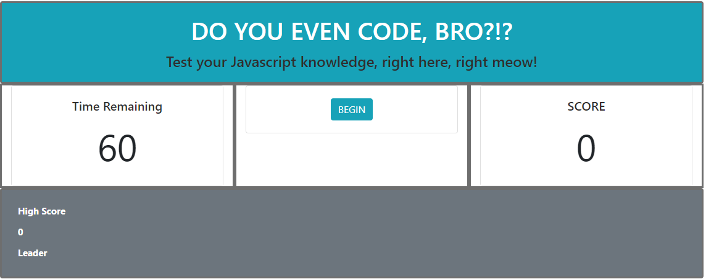

# coding_quiz

### DO YOU EVEN CODE BRO?!?

### PURPOSE

The purpose of this project is to quiz the user on their knowledge of Javascript. It is a short quiz, but it represents a large amount of code and functionality.

### REQUIREMENTS

There are ten questions. Any answer selection moves the user to the next question. Once the quiz is over, a "Game Over" card appears in the middle window. If the user answers correctly, they earn two points. If the user answers incorrectly, they lose a point and five seconds are removed from the clock. The game ends when the time reaches 0 or all of the questions are answered. If the user logs a new high score (which is both set and retrieved from loca storage) they are prompted to enter their initials. The initials and high score print on the scorecard at the bottom of the application.

Below is a screenshot of the application.

##### URL

https://laynehansen.github.io/coding_quiz/

### DIFFICULTIES

This was a very difficult, highly involved project. There were three main functions that I had to create. A timer, which turned out to be the easiest aspect. The scoreboard, which both increases and decreases in real time. Lastly is the middle "window" which is where the questions and answers are stored. 

I learned from a colleague that it's best to create separate script files in order to keep code better organized. I ended up with nearly 400 lines of JS code, which could be split into two or three smaller files. I'm looking forward to doing more with Javascript and JQuery in future projects. They are incredibly powerful and flexible tools that allow you to approach problems in several different ways.

### LESSONS (TAKEN FROM PREVIOUS PROJECT)

Previous lessons were both utilized and not-utilized. I once again got away from my pseudocod map, but overall did better with this than in previous efforts.

1) Whatever you imagine, you can create using HTML, CSS, and Javascript. I tried to put myself in place of an everyday internet user. They want a simple application that is straightforward, easy to use, pleasant to look at, and easy to use. I then designed the front end of the application with these things in mind.

2) Javascript is a very difficult language, especially having just been introduced to it. I liken it to a very difficult spoken language that you've never heard before. That said, it is a robust language that allows programmers several approaches to solving the problems they've been given.

3) Pseudocoding is extremely important with Javascript. This point has been stressed. The impulse is to nod your head, say "yeah yeah" and then move forward with coding. However, a half hour to an hour of planning and sketching and designing in pseudocode can save you HOURS at the back end of your project. I did pseduocode before beginning the project; however, I strayed away from my plans and got stuck in certain parts, where I didn't know how to proceed.

4) Stick to the plan you've created. If your plan isn't good enough, make it better. This ties in to #3. As mentioned, it's much better to take more time mapping your plan and then taking the time to pseudocode it before writing a single line of code. 

### SHOUT OUTS

AJ, Jake, Chris, Mason.

